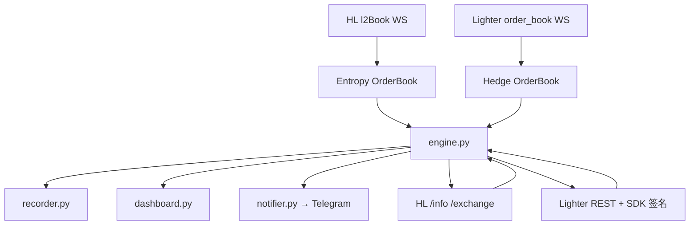

# 架构设计

## 总体架构

## 技术栈
- **后端:** Python 3.14 / asyncio / aiohttp / websockets
- **前端:** Rich 终端仪表盘（可选，--no-dashboard 关闭）
- **数据:** CSV（minutes.csv 分钟行情 / trades.csv 成交明细）

## 核心流程
- **信号:** `premium = entropy/hedge mid − 1`；卖出 entropy 需 `>= midline+upper`，买入需 `<= midline−lower`（均扣双边 taker 费）
- **执行:** `_scan` 找最优方向 → 双腿锁 → taker 双发 → 结算 → 净敞口对冲
- **对账:** `_reconcile_loop` 周期性链上仓位核对；unresolved 触发强制模式（3s 宽限 + 重试）
- **风控:** `_risk_loop`（30s）强平价距离 <10% → 双边平仓 + HALT；`_scan` 保证金预检；`_drift_loop` 中枢漂移哨兵

## 重大架构决策

| adr_id | title | date | status | affected_modules | details |
|--------|-------|------|--------|------------------|---------|
| ADR-01 | unresolved 熔断独立于限频熔断 | 2026-08-27 | ✅已采纳 | engine | [链接](../../history/2026-08/202608271001_phase1-risk-hardening/how.md#adr-01-unresolved-熔断独立于限频熔断) |
| ADR-02 | 漂移哨兵只停开仓不自动改 midline | 2026-08-27 | ✅已采纳 | engine | [链接](../../history/2026-08/202608271001_phase1-risk-hardening/how.md#adr-02-漂移哨兵只停开仓不自动改-midline) |
| ADR-03 | Lighter 查单走 REST accountOrders 而非 ws 历史 | 2026-08-27 | ✅已采纳 | venue_lighter | [链接](../../history/2026-08/202608271001_phase1-risk-hardening/how.md#adr-03-lighter-查单走-rest-accountorders-而非-ws-历史) |